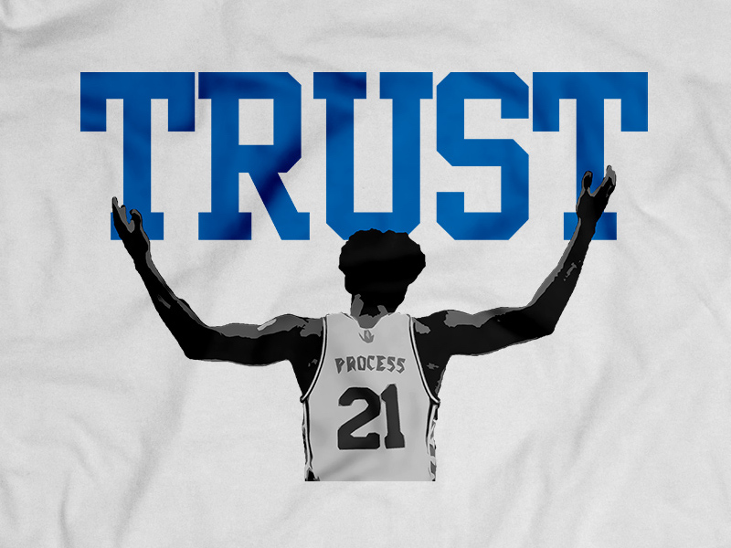
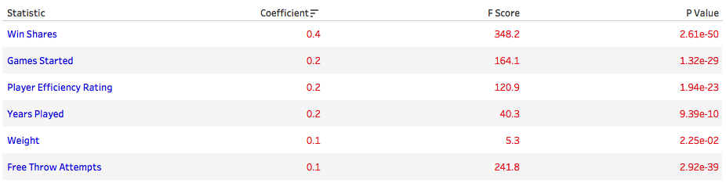

# Making an MVP

We are a group of 4 seaking to find the answer to the questions below using machine learning :

    Who will be the 2018 season's MVP?
    Can stats alone determine a player's salary?

## Trust The Process 

We are using a subbset of a [**kaggle dataset**](https://www.kaggle.com/drgilermo/nba-players-stats) with historical NBA data from 1990 to 2017 with player stats by year to train our model.

Additionally we found 2018 salary data from [**hoopshype.com**](http://hoopshype.com/salaries/players/)

From the stats available we selected the 15 features below.

- GS:	Games Started
- MP:	Minutes Played
- PER:	Player Efficiency Rating
- TRB%:	Total Rebound Percentage
- AST%:	Assist Percentage
- STL%:	Steal Percentage
- BLK%:	Block Percentage
- TOV%:	Turnover Percentage
- WS:	Win Shares
- FG%:	Field Goal Percentage
- 3P%:	3-Point Field Goal Percentage
- 2P%:	2-Point Field Goal Percentage
- FTA:	Free Throw Attempts
- FT%:	Free Throw Percentage
- PTS:	Points

After identifying the MVPs for each year and cleaning the data we trained and tested a logistic regression model, using the scikit-learn python package, to categorize players into **MVP** or **Not MVP** based on their stats. 

[**Check out the code**](./model_building/model_builder.ipynb). 

Additionally we used the same stats to train a linear regression model which will provide a salary based on a player's stats.

[**Check out the code**](./model_building/salary_model.ipynb). 

## Findings

### MVP Model

After testing and scoring our model we found that it is very good at determining who is **Not MVP** but is not very good a finding MVP.

This is due in part to the fact that we for the 27 years of data we have there are 27 MVPs and at least 10,000 Not MVPs.

Additionally we know MVP is not strictly based on stats alone and other factors like media airtime may need to be taken into account.

### Salary Model

The linear regression model may not be the best model for NBA salaries but after taking a closer look at the scaled coefficents below we did see that higher paid players tend to have higher values in these stats when compared to lower paid.

## And your 2018 MVP is.....

Just for fun we decided to use our model to predict the 2018 MVP.

The same stats we used in our MVP categorization model were not available for the 2017/2018 season so we retrained using the stats below.

- GS:	Games Started
- MP:	Minutes Played
- TRB%:	Total Rebound Percentage
- AST%:	Assist Percentage
- FG%:	Field Goal Percentage
- 3P%:	3-Point Field Goal Percentage
- 2P%:	2-Point Field Goal Percentage
- FTA:	Free Throw Attempts
- FT%:	Free Throw Percentage
- PTS:	Points

After feeding in the stats for 2018 we predict the 2018 MVP will be ...

### JAMES HARDEN

### Group Members:

- Sharath Ram Srinivasan
- Heath Pope
- Gar Cheuy
- Stephen Tsoi-A-Sue

*We created a tableau notebook with visualization for our process and findings which can be found in the [data_viz](./data_viz) directory of this repo. the "Final_Completed" workbook is our finished product.*

